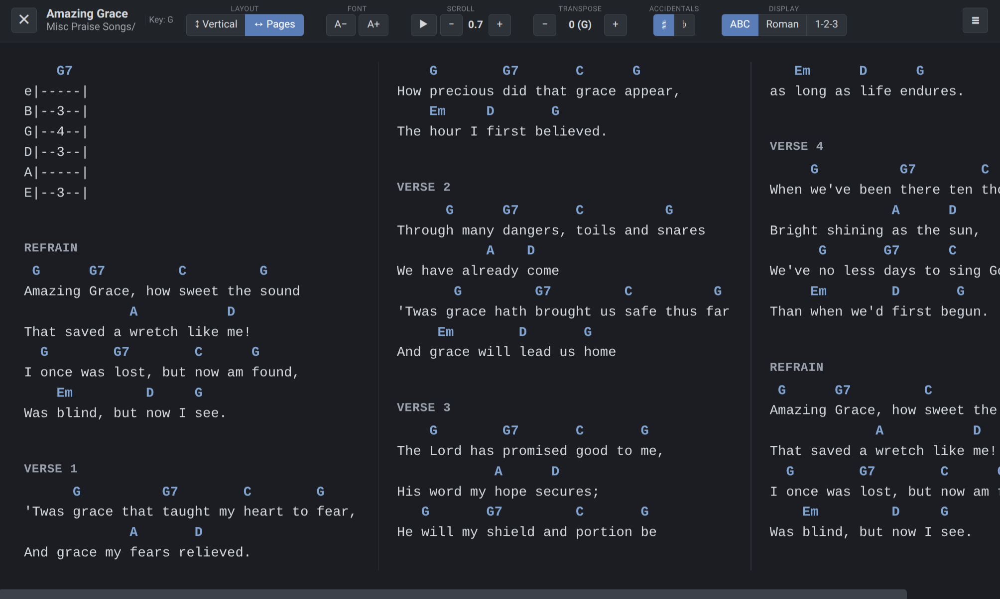
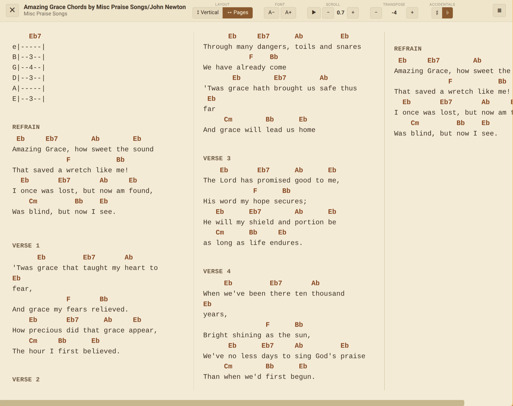
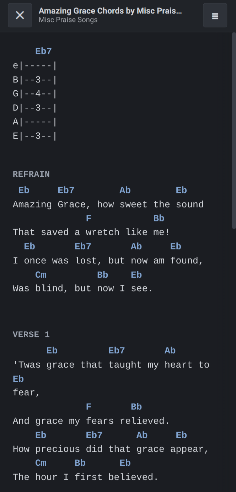

# LeadSheet Chord Reader

[](https://ko-fi.com/andrewmendelsohn)

A browser extension that turns chord sheet pages into a clean, distraction-free reader. Parses the existing page content client-side — no scraping, no network calls, no account required.

<p align="center">
  
</p>

<p align="center">
  
</p>

## Features

- **Transpose** up or down to any key, with sharps/flats toggle
- **Auto-scroll** at adjustable speed — hands-free practice
- **Multiple color themes** — Nord, Dracula, Solarized, Sepia, and more
- **Two layouts** — Vertical (scroll down) or Pages (columns, scroll right)
- **Keyboard shortcuts** for everything
- **Responsive toolbar** — collapses into a hamburger menu on narrow screens
- **Works on mobile** — Firefox for Android supported

<p align="center">
  
</p>

## Supported Sites

- [Ultimate Guitar](https://tabs.ultimate-guitar.com) (tabs.ultimate-guitar.com)
- [E-Chords](https://www.e-chords.com) (e-chords.com)
- [Cifra Club](https://www.cifraclub.com) (cifraclub.com)
- [AZChords](https://www.azchords.com) (azchords.com)
- [UkuTabs](https://ukutabs.com) (ukutabs.com)
- [Chordie](https://www.chordie.com) (chordie.com)

## Install

**Chrome / Edge:** [Chrome Web Store](#) (coming soon)

**Firefox / Firefox Android:** [Firefox Add-ons](#) (coming soon)

### From source

```bash
npm install
npm run build          # Chrome → dist/
npm run build:firefox  # Firefox → dist-firefox/
```

- **Chrome/Edge:** `chrome://extensions/` → Developer mode → Load unpacked → select `dist/`
- **Firefox:** `about:debugging#/runtime/this-firefox` → Load Temporary Add-on → select `dist-firefox/manifest.json`

## Keyboard Shortcuts

| Key | Action |
|-----|--------|
| `Esc` | Close reader |
| `↑` / `↓` | Transpose up/down |
| `←` / `→` / `PgUp` / `PgDn` | Page scroll |
| `+` / `-` | Font size up/down |
| `v` | Vertical layout |
| `h` | Horizontal / Pages layout |
| `Space` | Toggle auto-scroll |
| `b` | Toggle flats/sharps |

## Privacy

No tracking, no analytics, no accounts, no network requests. The extension reads the chord page you already have open and renders it locally. Your preferences are stored in your browser via `chrome.storage.local` and never leave your device.

[Full privacy policy](docs/PRIVACY.md)

## Contributing

Contributions welcome! The extension is TypeScript with no framework — just esbuild for bundling and Shadow DOM for isolation.

### Adding a new site

1. Create a parser in `src/content/parsers/` implementing the `SiteParser` interface
2. Register it in `src/content/parsers/index.ts`
3. Add URL patterns to both `manifest.json` and `manifest.firefox.json`

See [CLAUDE.md](CLAUDE.md) for architecture details.

## License

MIT

## Author

Andrew Mendelsohn — [Mendelsohn Labs LLC](https://ko-fi.com/andrewmendelsohn)
